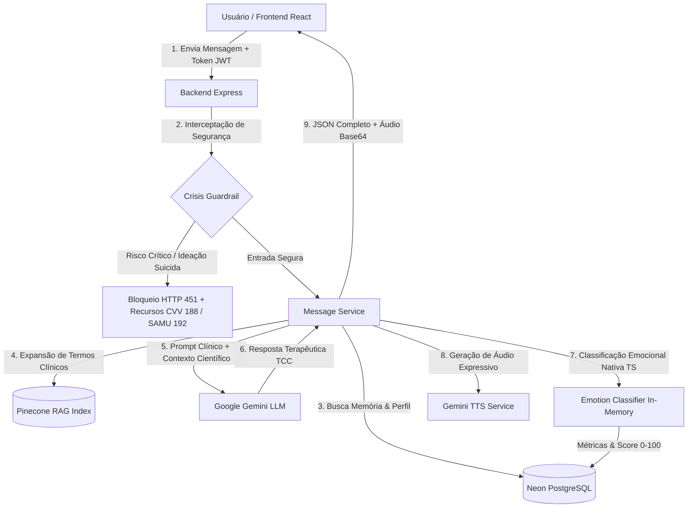

# PSAI — Psychological Support AI 🧠🌿

O **PSAI** é um **Diário Terapêutico Inteligente e Co-terapeuta Clínico** projetado para fornecer escuta ativa, suporte emocional estruturado, triagem de sentimentos e reflexões guiadas com base na **Terapia Cognitivo-Comportamental (TCC)** e abordagens humanistas.

O ecossistema é construído como um monorepo **100% TypeScript**, integrando um frontend responsivo e empático em **React** a um backend resiliente em **Node.js/Express**, orquestrando uma arquitetura de IA multimodal baseada no **Google Gemini**, banco vetorial **Pinecone**, pagamentos via **Asaas** e persistência com **Prisma ORM (PostgreSQL/Neon)**.

---

## 🌐 Demonstração Online

O projeto está implantado e em produção na Vercel:
👉 **[Acessar PSAI Web Application](https://psai-alpha.vercel.app/)**

---

## 🛠️ Tecnologias e Stack Completa

### 💻 Frontend
- **React (v18)** com **TypeScript** e **Vite**: Arquitetura modular de componentes com tipagem estrita e hot reload instantâneo.
- **Tailwind CSS**: Paleta cromática terapêutica (*Soothing Lavender & Emerald Pastel*) com alto contraste para acessibilidade emocional.
- **Framer Motion**: Microinterações suaves, efeito de digitação terapêutica e transições orgânicas de estado.
- **Recharts**: Gráficos analíticos de evolução do humor, índices de bem-estar e histórico emocional do paciente.
- **Lucide React**: Iconografia moderna e semântica.
- **Web Audio API & Speech Synthesis**: Suporte a gravação de voz contínua, interrupção ao vivo e reprodução de áudio expressivo.

### ⚙️ Backend
- **Node.js (v20 LTS)** + **Express** + **100% TypeScript**: Rotas, controllers, middlewares e serviços desacoplados e tipados.
- **Prisma ORM**: Modelagem de dados com migrações declarativas e pool de conexões otimizado para serverless/PostgreSQL (**Neon Database**).
- **Classificador de Emoções Nativo (TS)**: Motor *Multinomial Naive Bayes* próprio em TypeScript com suavização de Laplace e lematização em português, substituindo o antigo runtime Python/NLTK para inferência in-memory (< 1ms).
- **Asaas SDK / Webhooks**: Integração completa de assinaturas, cobranças recorrentes e pagamentos via PIX e Cartão de Crédito.
- **Segurança Reforçada**: Helmet (HSTS, NoSniff), CORS com validação de origens em produção, rate-limiting contra abuso e validação de payloads via **Zod**.
- **Autenticação**: Criptografia segura com **Bcryptjs** e emissão de tokens **JWT** stateless.

### 🧠 Inteligência Artificial & Vetores
- **Google Gemini Multimodal API**:
  - `gemini-1.5-flash` / `gemini-2.5-flash`: Raciocínio clínico socrático, síntese de contexto e reformulação terapêutica.
  - `gemini-3.8-flash-tts`: Síntese de voz expressiva com entonação empática e dinâmica emocional.
- **Groq API**: Camada de contingência (fallback redundante) com modelos `llama-3.3-70b-versatile` e `llama-3.1-8b-instant`.
- **Pinecone Vector Database**: Armazenamento vetorial de livros e artigos de TCC (`text-embedding-004` / `gemini-embedding-2`) para o motor de RAG Semântico.

---

## 🏛️ Arquitetura do Sistema



---

## 🔬 Destaques de Engenharia e Inovação

### 1. Migração 100% TypeScript (Zero-Python Architecture)
- Anteriormente, o backend dependia de scripts Python (`classify_emotion.py`), NLTK e Pandas, exigindo subprocessos (`child_process.spawn`) que causavam lentidão e timeouts de até 4 segundos.
- O novo **`emotionClassifier.ts`** implementa um classificador estatístico Naive Bayes compilado nativamente no runtime Node.js.
- **Resultados:** Tempo de inferência reduzido de ~800ms para **menos de 0.1ms**, imagem Docker enxugada em mais de 500MB e eliminação de 3 milhões de linhas de arquivos temporários do NLTK.

### 2. Dual RAG (Memória Pessoal + Base de Conhecimento Científico)
- **RAG Pessoal:** Resgate histórico das sessões anteriores armazenadas no PostgreSQL para contextualizar sentimentos recorrentes sem estourar a janela de contexto.
- **RAG Científico:** O sistema analisa a fala do usuário (ex: *"sinto que tudo vai dar errado"*), converte em terminologia técnica (ex: *"catastrofização reestruturação cognitiva"*), realiza busca vetorial de similaridade cosseno no Pinecone e injeta os trechos correspondentes dos livros de psicologia no prompt da resposta.

### 3. Guardrail de Crises e Ética Clínica (CVV 188 / SAMU 192)
- Expressões de automutilação, ideação suicida ou desesperança extrema são capturadas de forma determinística antes de qualquer chamada a LLMs.
- Em caso de gatilho, a resposta é imediatamente interceptada com mensagem de acolhimento emergencial, orientação humanitária e telefones de socorro imediato, em conformidade com as diretrizes do Conselho Federal de Psicologia para ferramentas de auxílio tecnológico.

### 4. Modo Live de Voz & Interrupção Inteligente
- Sistema de conversação por voz com botão de parada instantânea (`Stop AI`), permitindo interrupções fluidas durante a reprodução do áudio caso o usuário deseje falar novamente ou pausar o agente.

### 5. Faturamento e Monetização com Asaas
- Gestão completa de planos e assinaturas recorrentes com suporte a PIX dinâmico (com QR Code e Copia-e-Cola) e Cartão de Crédito.
- Webhooks com autenticação por token para liberação automática de funcionalidades do plano do usuário.

---

## 🚀 Como Executar o Projeto Localmente

### 1. Pré-requisitos
- **Node.js (v18+)** e **npm** instalados.
- Instância do **PostgreSQL** (local ou [Neon.tech](https://neon.tech/)).

### 2. Variáveis de Ambiente
Crie um arquivo `.env` dentro da pasta `backend/` baseado no `.env.example`:
```bash
cp backend/.env.example backend/.env
```
Preencha as chaves:
- `DATABASE_URL`: URI de conexão com o PostgreSQL.
- `JWT_SECRET`: Chave secreta para assinatura dos tokens.
- `GEMINI_API_KEY`: Chave da API do Google AI Studio.
- `PINECONE_API_KEY` & `PINECONE_INDEX_NAME`: Credenciais do banco vetorial.
- `ASAAS_API_KEY`: Chave de integração do Asaas (modo Sandbox ou Produção).

### 3. Instalação e Inicialização do Banco
```bash
# Na raiz do monorepo:
npm install

# Gerar o cliente Prisma e aplicar o schema:
npm run db:generate
npm run db:migrate
```

### 4. Execução em Desenvolvimento
```bash
# Executa simultaneamente o backend (:5000) e o frontend (:3000):
npm run dev
```

### 5. Execução dos Testes Automatizados
```bash
# Teste dos Guardrails de Segurança contra Crises:
npx ts-node backend/src/tests/crisisGuardrail.test.ts

# Teste do Classificador Nativo de Emoções e TTS:
npx ts-node backend/src/tests/emotion.test.ts
```

---

## 🚢 Deploy na Vercel

O projeto está configurado para deploy monolítico automatizado na Vercel através do [`vercel.json`](./vercel.json) e [`Dockerfile.vercel`](./backend/Dockerfile.vercel):
- O frontend é compilado em assets estáticos otimizados (`backend/public`).
- O servidor Express em container assume o roteamento da SPA e todos os endpoints da `/api/*`.
- Deploy sincronizado em repositório privado (`origin`) e espelho público (`upstream`).

---

## 🔒 Privacidade e Segurança
- Nenhuma chave de API ou segredo de produção é versionado no Git (`.gitignore` abrangente).
- Logs anonimizados em métricas de crise e conformidade com boas práticas de privacidade de dados sensíveis.
