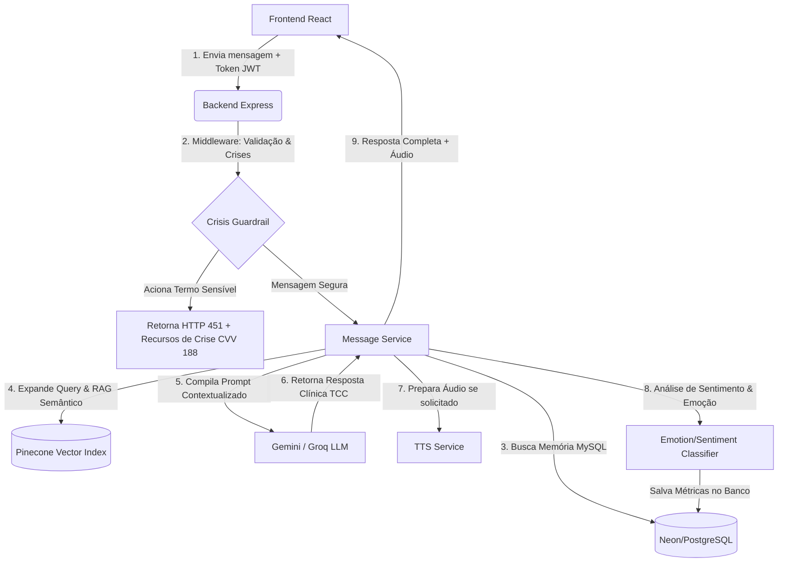

# PSAI — Psychological Support AI

O **PSAI** é um **Diário Terapêutico Inteligente e Co-terapeuta** projetado para fornecer escuta ativa, suporte emocional estruturado e reflexões guiadas com base na **Terapia Cognitivo-Comportamental (TCC)** e em abordagens clínicas humanistas.

O sistema funciona como um monorepo que integra um frontend dinâmico em **React** a um backend seguro e escalável em **Node.js/Express**, orquestrando uma arquitetura de IA baseada na API do **Google Gemini** e no banco vetorial **Pinecone**.

---

## Visualização do Projeto

O projeto está disponível para visualização e testes online através do seguinte link:
👉 **[PSAI - Web Application](https://psai-frontend-794942769529.us-central1.run.app/)**

---

## Tecnologias Utilizadas

### Frontend
- **React (v18)** com **TypeScript** e **Vite** para desenvolvimento ultra-rápido.
- **Tailwind CSS** para estilização utilitária e design minimalista e terapêutico (Soothing Lavender & Emerald Pastel).
- **Framer Motion** para animações fluidas e transições suaves de tela.
- **Recharts** para geração de gráficos estatísticos do progresso emocional do usuário.
- **Lucide React** para iconografia moderna.
- **Axios** para comunicação assíncrona com as APIs do backend.

### Backend
- **Node.js** com **Express** e **TypeScript** estruturado de forma modular (rotas, controllers, middlewares e services).
- **Prisma ORM** como interface de banco de dados flexível conectada ao **PostgreSQL** (hospedado no **Neon Database**).
- **JSON Web Tokens (JWT)** e **Bcryptjs** para controle de sessões, criptografia de senhas e autenticação de usuários.
- **Zod** para validação robusta de esquemas de dados.
- **pdf-parse** para extração de textos de livros/artigos científicos e alimentação do RAG.
- **Edge-TTS** (Node local) e **ElevenLabs API** para conversão de texto em fala (Text-To-Speech).

### Inteligência Artificial e Bancos de Vetores
- **Google Gemini API** (`gemini-3.1-flash-lite`, `gemini-3.5-flash`, `gemini-embedding-2`) como motor cognitivo principal e gerador de embeddings.
- **Groq API** (`llama-3.3-70b-versatile`, `llama-3.1-8b-instant`, `gemma2-9b-it`) configurada como camada de redundância (fallback automático).
- **Pinecone Vector Database** para armazenamento e pesquisa semântica dos materiais de apoio científicos (RAG).

---

## Arquitetura do Sistema

O PSAI utiliza um modelo cliente-servidor monorepo. O fluxo de dados básico pode ser visualizado abaixo:



---

## Lógica da Arquitetura de IA

A inteligência artificial do PSAI não é apenas um chatbot genérico; ela é guiada por uma pipeline lógica robusta e ética:

### 1. Sistema Dual de RAG (Retrieval-Augmented Generation)
Para garantir que o PSAI converse de forma personalizada e embasada cientificamente, ele recupera contextos de duas fontes diferentes em tempo real:
- **RAG de Memória Histórica (MySQL/Neon):** O sistema analisa o input do usuário, extrai palavras-chave principais e busca relatos ou tópicos trazidos pelo usuário em sessões anteriores no banco relacional. Isso evita que o agente perca o contexto do tratamento a longo prazo sem sobrecarregar a janela de contexto.
- **RAG de Biblioteca Científica (Pinecone):** Quando o usuário relata uma dor ou sintoma, o backend utiliza um prompt especializado (`generateSearchQuery`) para expandir o relato em termos técnicos da psicologia (ex: se o usuário diz *"não consigo parar de pensar no pior"*, a IA gera *"catastrofização reestruturação cognitiva"*). O sistema converte isso em embeddings e busca trechos correspondentes de livros de TCC no Pinecone, injetando esse conteúdo científico diretamente no prompt da resposta.

### 2. Filtro de Crise e Segurança (Crisis Guardrail)
Como agente de suporte psicológico por IA, o PSAI possui barreiras éticas e legais rígidas. 
- O middleware `crisisGuardrailMiddleware` intercepta todas as mensagens do usuário antes de enviá-las ao LLM.
- Se termos ou padrões associados a suicídio, automutilação ou sofrimento agudo forem detectados via expressões regulares avançadas, a requisição é bloqueada imediatamente.
- O backend registra o incidente em modo anônimo (apenas contagem e termos mapeados para métricas de segurança) e retorna um status **HTTP 451 (Unavailable For Legal Reasons)** contendo contatos oficiais de emergência, como o **CVV (Centro de Valorização da Vida - 188)** e o **SAMU (192)**.

### 3. Classificação Emocional e Análise de Sentimento
A cada interação, o PSAI submete a fala do usuário a duas classificações paralelas:
- **Sentimento:** Um modelo em JSON classifica a fala em um dos cinco estados dominantes: *Neutral*, *Anxiolytic* (Ansiedade/Medo), *Depressive* (Tristeza/Solidão), *Happy* (Alegria/Paz) ou *Stressed* (Estresse/Raiva). Também gera um score numérico de bem-estar emocional de 0 a 100.
- **Emoção:** Um classificador secundário mapeia nuances da fala para predições emocionais detalhadas.
Esses dados são salvos no banco de dados para alimentar os gráficos do dashboard do usuário, permitindo o acompanhamento visual da evolução do seu humor ao longo do tempo.

### 4. Engenharia de Prompt Clínico (System Instruction)
O prompt de sistema do Gemini combina escuta ativa terapêutica, regras clínicas para perguntas socráticas direcionadas e limites éticos estritos. A IA é proibida de usar jargões excessivamente robóticos ou clichês empáticos repetitivos (ex: *"sinto muito por isso..."*), agindo com a linguagem natural de um psicólogo humano real, mantendo respostas concisas de 1 a 2 parágrafos para agilizar o tempo de leitura e a síntese de voz (TTS).

---

## Como Executar o Projeto Localmente

### 1. Pré-requisitos
- Node.js (v18+) instalado.
- Banco de dados PostgreSQL rodando localmente ou na nuvem (ex: Neon DB).
- Chaves de API do Google Gemini, Pinecone e Groq (opcional, como backup).

### 2. Clonar e Configurar Variáveis
Copie o arquivo de exemplo de variáveis de ambiente no diretório `backend` e preencha com as suas chaves reais:
```bash
cp backend/.env.example backend/.env
```

### 3. Instalar Dependências e Inicializar Banco de Dados
Na raiz do monorepo, execute:
```bash
# Instalar dependências de todo o projeto
npm install

# Gerar o client do Prisma ORM e rodar as migrações do banco
npm run db:generate
npm run db:migrate
```

### 4. Rodar o Monorepo
Para rodar o frontend e o backend simultaneamente no modo de desenvolvimento:
```bash
npm run dev
```
O Frontend estará rodando na porta **3000** (`http://localhost:3000`) e o Backend na porta **5000** (`http://localhost:5000`).

---

## Segurança e .gitignore
Este repositório está configurado para não subir credenciais, chaves de API, segredos JWT ou arquivos temporários de dados. 
- O arquivo `.gitignore` raiz ignora de forma abrangente as pastas de compilação (`dist`, `build`), arquivos de ambiente (`.env*`), caches de agentes (`.gemini`, `.agents`, `graphify-out`), banco de dados sqlite local (`*.db`) e quaisquer pastas de trabalho temporárias.
